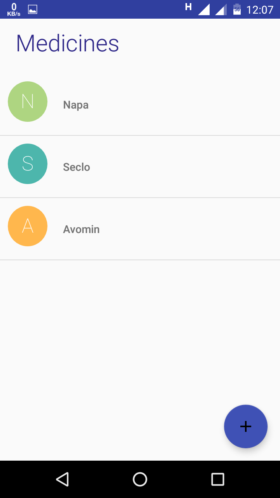
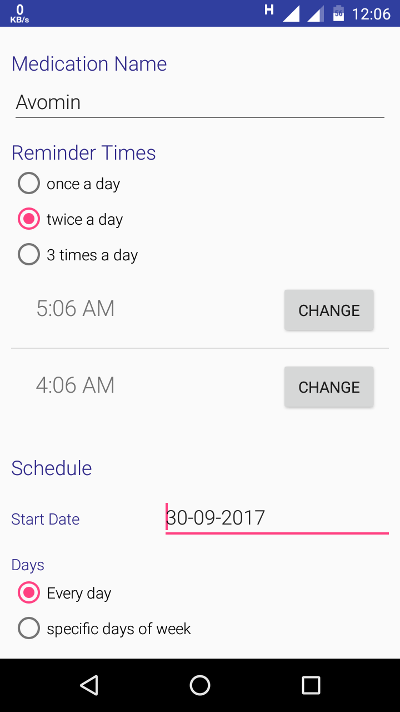
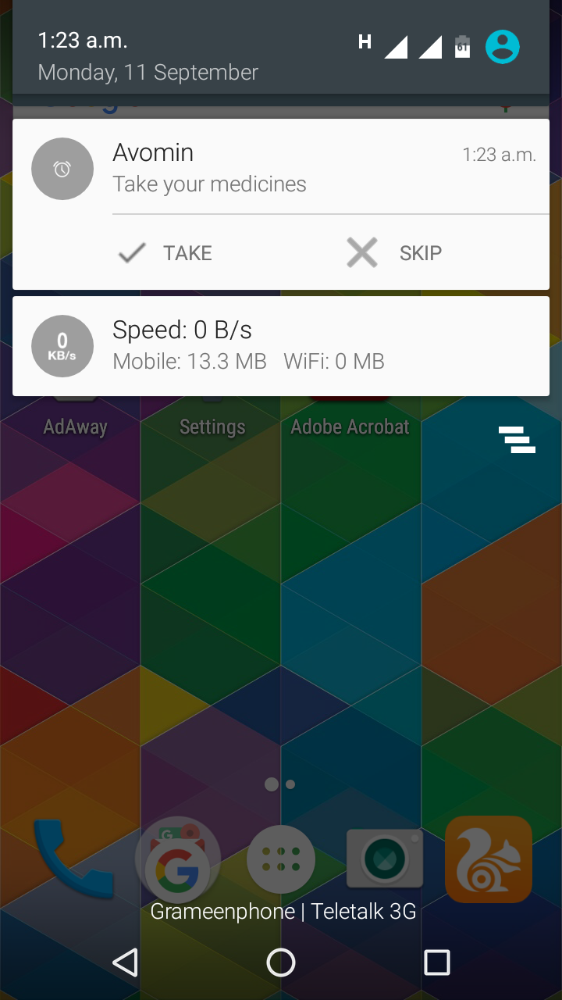
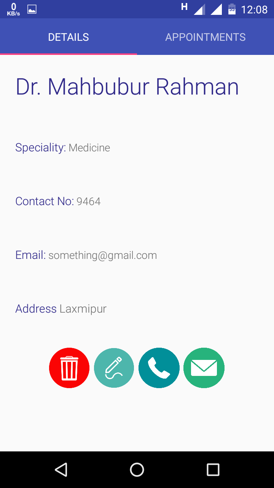
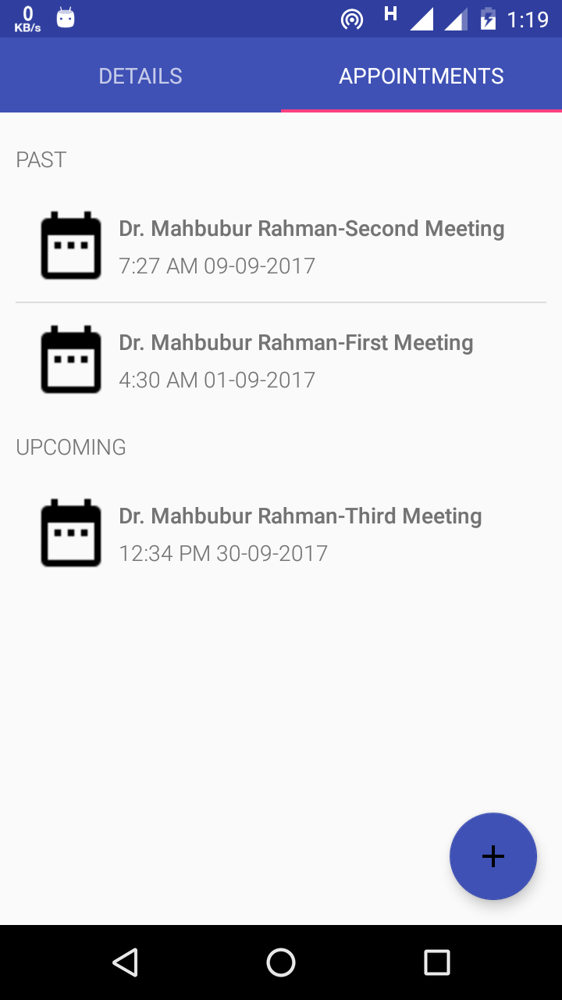

## Attendance Manager
 
__Med Organizer__ is an Android app for adding medications, getting reminders for taking pills with greater emphasis on gathering all critical data regarding user health in one place.

### Features
* Clean and minimalistic user-interface
* Multi-user system
* Add medication with many customizations
* Medication reminder
* Keep track of doctor appointments

### Screenshots
						